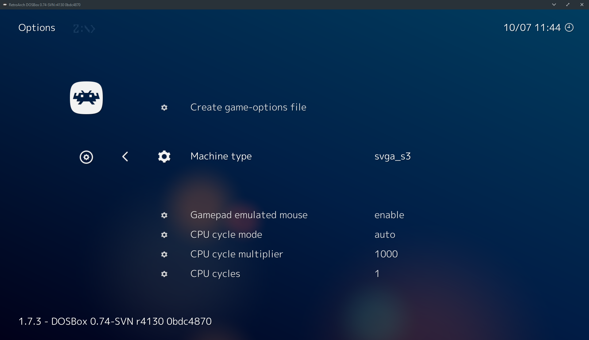
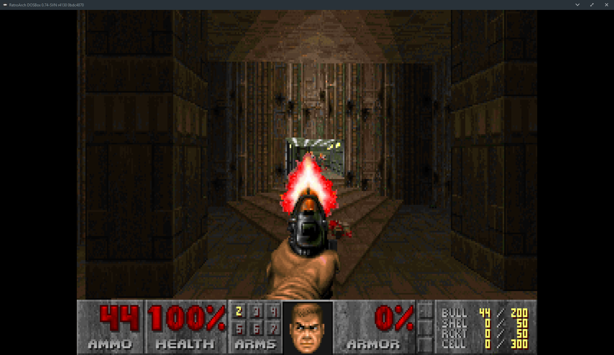
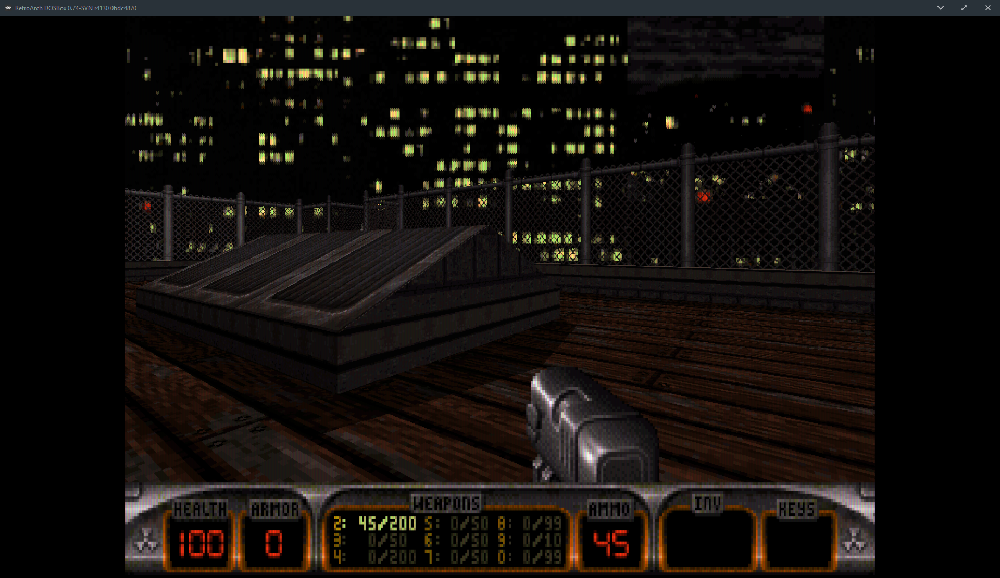
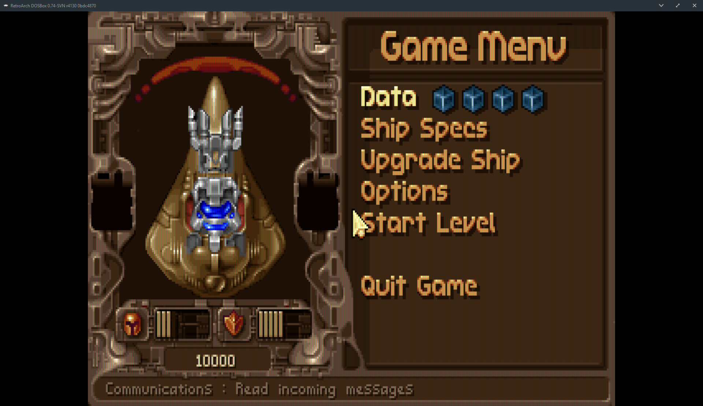
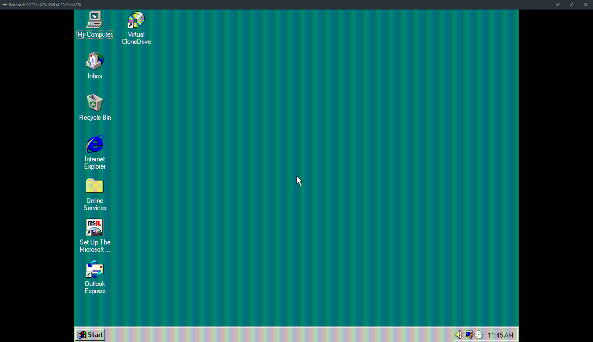

## DOSBox-SVN libretro

Upstream port of DOSBox to libretro.

### Keeping up-to-date
Clone the repo from the svn upstream:

```bash
git svn clone svn://svn.code.sf.net/p/dosbox/code-0/dosbox/ dosbox-svn
```

This takes a few hours. Then add a remote for the git repo:

```bash
cd dosbox-svn
git remote add origin https://github.com/fr500/dosbox-svn.git --> replace this with your repo URL if you're working in a fork
git fetch
git checkout master
git svn rebase
```

Switch to libretro branch and work there instead, don't make any changes to master:

```
git checkout libretro
git rebase master
```

Do your work, resolve conflicts if any, and then:
```bash
git push --force
```

### Compilation
So far it's compiling on Windows, Linux, Android and OSX.

####Requirements

- SDL1.2
- SDL_net

To build on Windows we recommend MSYS2 (https://www.msys2.org/).
Install MSYS2, and follow these instructions:

#### Update Environment

Start the MSYS2 shell and run:

```bash
pacman --noconfirm -Sy
pacman --needed --noconfirm -S bash pacman pacman-mirrors msys2-runtime
```

Restart MSYS2 and run:

```bash
pacman --noconfirm -Su
```

#### Install the Toolchain

For 32-bit builds run:

```bash
pacman -S --noconfirm --needed wget git make mingw-w64-i686-toolchain mingw-w64-i686-ntldd mingw-w64-i686-zlib mingw-w64-i686-pkg-config mingw-w64-i686-SDL2 mingw-w64-i686-SDL mingw-w64-i686-SDL_net
```

For 64-bit builds run:

```bash
pacman -S --noconfirm --needed wget git make mingw-w64-x86_64-toolchain mingw-w64-x86_64-ntldd mingw-w64-x86_64-zlib mingw-w64-x86_64-pkg-config mingw-w64-x86_64-SDL2 mingw-w64-x86_64-SDL mingw-w64-x86_64-SDL_net
```

#### Building

```bash
cd libretro
make -j4
```

If you want to enable the dynarec:

```bash
make -j8 WITH_DYNAREC=$ABI
```

The valid ABI choices are `arm, oldarm, x86_64, x86, ppc, mips`

The `x86_64` dynarec doesn't work on windows so far. For better performance x86 is recommended

### Usage

Use like normal DOSbox, you can load exe files or conf files directly.

Cycle increase hot-keys **do-not-work**. Instead you should leverage *Core Options*. Refer to your libretro frontend documentation for reference on how to access these options.

For GLIDE support (non-hw accelerated) use the glide branch.

### Screenshots






As with official DOSBox, Windows is not officially supported (but it works)




